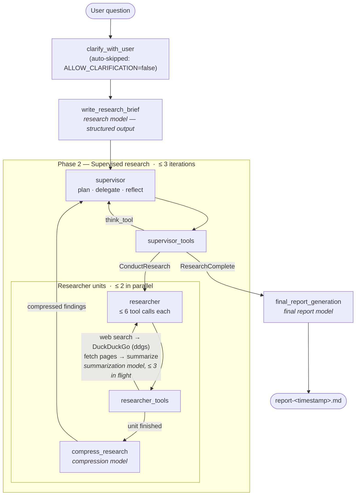

# 🔬 Open Deep Research — Local Edition (RTX 5090)

[LangChain's Open Deep Research](https://github.com/langchain-ai/open_deep_research) adapted to run **100% locally** on a single consumer GPU — no OpenAI, no Anthropic, no search API keys. Every model call runs on your own hardware; web search is keyless.

Built and validated on an NVIDIA RTX 5090 (32GB VRAM) with **Qwen3.6 35B-A3B** (MoE, 3B active) served by Ollama. A full deep-research run makes ~130 model calls over ~1h45m and produces a cited multi-page report.

📄 Sample output: [examples/rtx5090-local-models-report.md](examples/rtx5090-local-models-report.md) — the pipeline researching its own subject (best local models for a 32GB GPU, Aug 2026).
🛠️ Full build/debugging log: [WORKLOG.md](WORKLOG.md) · raw logs from all six runs (including a [hallucinated failure case](examples/failure-case-run1-hallucinated-report.md)) in [logs/](logs/)

## Research phases



All four italicized model roles are the *same* local model (`qwen3.6-odr` via Ollama) — they're separate config knobs upstream, kept separate here so you can mix models (e.g., a dense model for the final report). On the validation run, Phase 2 dominated wall time: ~95 of the ~130 model calls across 1h43m, with the report write itself taking ~70 seconds.

## How it works

Everything upstream stays intact — the LangGraph supervisor/researcher architecture, prompts, and report generation. This fork adds:

| Change | Why |
|---|---|
| **`SearchAPI.DUCKDUCKGO`** backend (`configuration.py`, `utils.py`) | Keyless web search via [`ddgs`](https://pypi.org/project/ddgs/) (rotates Brave/Startpage/Mojeek/…). Mimics the Tavily response shape, so the existing dedupe → summarize → cite machinery is unchanged. Fetches full page text with aiohttp + lxml. |
| **Bounded summarization concurrency** (`utils.py`) | Local inference servers split decode throughput across *all* admitted requests — an unbounded burst of 40 summarization calls means none finish (measured: 6.8s solo → 55-70s each at just 8 concurrent). A semaphore caps in-flight calls at 3 per search. |
| **Event-loop-safe page fetching** (`utils.py`) | Size-capped (2MB) streaming downloads and HTML parsing moved off the event loop (`asyncio.to_thread` + lxml). Parsing big pages inline froze asyncio for minutes and starved every pending request. |
| **600s summarization timeout** (`utils.py`) | The upstream 60s timeout assumes cloud-API latency; queued local calls legitimately wait minutes. |
| **`run_research.py`** | Headless runner — no LangGraph Studio needed. Streams progress, writes `report-<timestamp>.md`. |

## Quickstart

Requirements: a ~32GB GPU, [Ollama](https://ollama.com) ≥ 0.22, [uv](https://docs.astral.sh/uv/), Python 3.11+.

```bash
# 1. Model: pull Qwen3.6 35B-A3B and bake in a 64K context window
ollama pull qwen3.6:35b
printf 'FROM qwen3.6:35b\nPARAMETER num_ctx 65536\n' > /tmp/Modelfile
ollama create qwen3.6-odr -f /tmp/Modelfile   # ~28GB loaded, fits 32GB with desktop running

# 2. Install
git clone https://github.com/binaryninja/open-deep-research-local.git
cd open-deep-research-local
uv sync

# 3. Configure — the committed .env.example is already set up for local Ollama
cp .env.example .env

# 4. Run
.venv/bin/python run_research.py "your research question"
# → ./report-<timestamp>.md  (expect ~1.5-2h on a 5090)
```

The model roles route through Ollama's **OpenAI-compatible endpoint** (`OPENAI_BASE_URL=http://localhost:11434/v1`, `OPENAI_API_KEY=ollama`, models named `openai:qwen3.6-odr`). This is deliberate: the graph passes `max_tokens`/`api_key` kwargs that `ChatOpenAI` accepts and `ChatOllama` doesn't.

## Local-inference gotchas we hit (so you don't have to)

1. **Throughput splitting.** Ollama admits every concurrent request and divides decode speed evenly among them. Timeouts must account for *queue-wide* latency, or better: bound your client-side concurrency.
2. **`json_schema` needs thinking left on.** Ollama's OpenAI-compat endpoint stops enforcing `response_format: json_schema` when reasoning is disabled (`reasoning_effort: "none"`), and it ignores forced `tool_choice` — so "speed up structured output by disabling thinking" breaks it. Keep thinking on for structured calls.
3. **Never parse HTML on the event loop.** One big page freezes asyncio and every in-flight request with it.
4. **No sudo? Use a Modelfile.** Context length can't be set via the systemd service env without root; `PARAMETER num_ctx` in a derived model works per-model.

## Alternative models (Aug 2026, 32GB class)

| Model | Trade-off vs Qwen3.6-35B-A3B |
|---|---|
| `qwen3.6:27b` (dense) | Higher benchmark scores, ~3× slower decode — consider for `FINAL_REPORT_MODEL` only |
| Poolside Laguna XS 2.1 | Stronger coding/terminal agent, weaker general research/writing |
| `gpt-oss:20b` | Fastest + cleanest tool JSON, but 128K context and lower reasoning scores |

Optional: a free [Tavily](https://www.tavily.com/) key (1,000 searches/mo) gives cleaner results than the DDG rotation — set `TAVILY_API_KEY` and `SEARCH_API=tavily`.

## Credits & license

Fork of [langchain-ai/open_deep_research](https://github.com/langchain-ai/open_deep_research) (MIT). All upstream credit to the LangChain team. Local adaptation changes are MIT as well — see [LICENSE](LICENSE).
